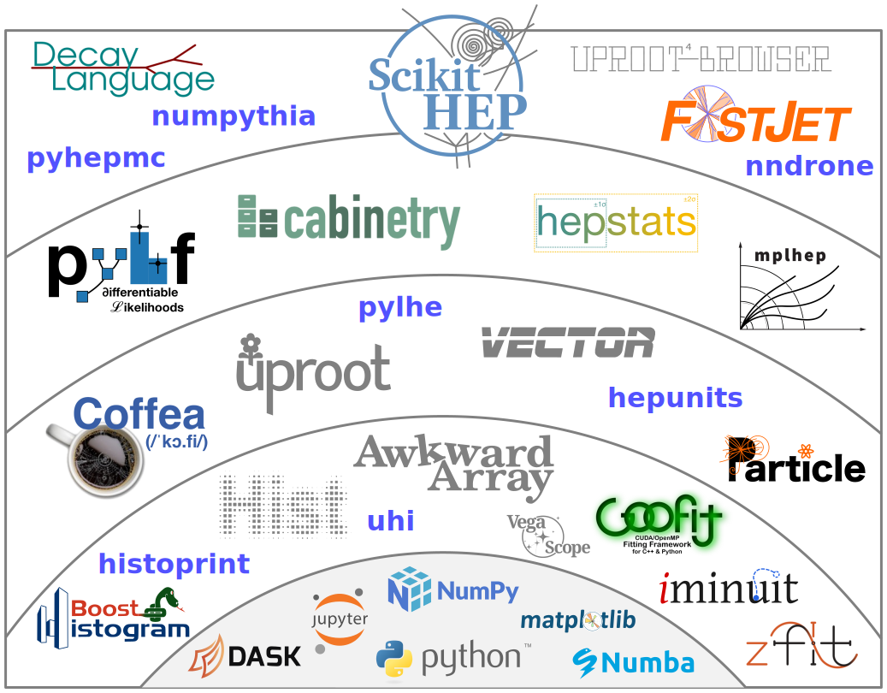
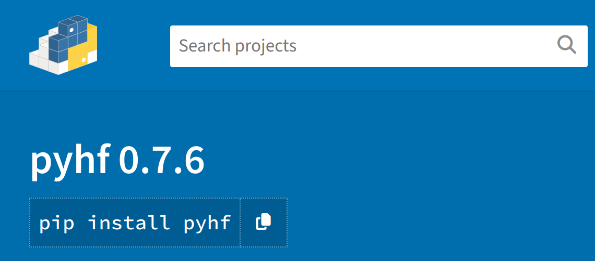

class: middle, center, title-slide
count: false

# Towards Differentiable Physics Analysis
# at the HL-LHC and Beyond

.huge.blue[Matthew Feickert] 
.huge[(University of Wisconsin-Madison)]
  
[matthew.feickert@cern.ch](mailto:matthew.feickert@cern.ch)

[SMU Physics Department Speaker Series](https://matthewfeickert-talks.github.io/talk-smu-seminar-2023/)

October 2nd, 2023

<!-- ---
# Notes

* .bold[Time]: 50 minutes
* .bold[Abstract:] With the High-Luminosity Large Hadron Collider (HL-LHC) era on the horizon for physics analysis at the LHC experiments there are multiple challenges to be overcome to efficiently analyze and extract the most scientific value from the unique and valuable data. In this seminar I will present a high-level overview of how applications of data science tools from the modern scientific open source community, techniques and applications from the field of automatic differentiation, and strategies for enabling analysis reuse can be leveraged to tackle physics analysis at the HL-LHC scale. -->

---
# Introduction

.kol-2-3[
.huge[
* Privileged opportunity to work among multiple scientific communities
* Care about .bold[reusable] open science to be able to push particle physics forward at the .bold[community scale]
   - The challenges of the next decade provide wonderful research environments that will require interdisciplinary knowledge exchange to fully attack
* Today we'll share .bold[high level] views of deeply .bold[technical problems]
]
]
.kol-1-3[
.center.width-65[]

.center.width-40[]

.center.width-40[]

.center.width-30[]

.center.width-30[]
]

---
# High Energy Physics at the LHC

.kol-1-2.center[

   

.caption[LHC]
]
.kol-1-2.center[

   

.caption[ATLAS]
]
.kol-1-1[
.kol-1-2.center[

   

]
.kol-1-2.center[
.kol-1-2.center[

   

]
.kol-1-2.center[

   

]
]
]

---
# Opportunities and Challenges of the HL-LHC
<!--  -->

   

<!--  -->
.large[
* Increase in luminosity of roughly order of magnitude
   - $3$ - $4$ $\mathrm{ab}^{-1}$ (factor of 20-25 from Run-2 delivered)
* Boon for measurements constrained by statistical uncertainties, searches for rare processes
]

---
# Opportunities and Challenges of the HL-LHC

.center.large[Challenge to be able to .bold[record, store, and analyze] the data]

.kol-1-2[

   

]
.kol-1-2[
 

   

]

.center.large[Projected .bold[required compute usage] for HL-LHC (want R&D below budget line)]

.center[[ATLAS](https://cds.cern.ch/record/2803119?ln=en) and [CMS](https://cds.cern.ch/record/2815292?ln=en) software and computing reviews]

---
# IRIS-HEP

.kol-3-5[

   

.large[
* LHC experiments as stakeholders
* LHC operations as partners
]
]
.kol-2-5[
 

   

.caption[Institute for Research and Innovation in Software for High Energy Physics (IRIS-HEP)

supported by the National Science Foundation Cooperative Agreements [OAC-1836650](https://www.nsf.gov/awardsearch/showAward?AWD_ID=1836650)  and [PHY-2323298](https://www.nsf.gov/awardsearch/showAward?AWD_ID=2323298)
]
]

---
# IRIS-HEP

.kol-1-1[
.kol-1-2[
.huge[
Designed around [focus areas](https://inspirehep.net/literature/2628983)
]
.large[
* Intellectual Hub
* Analysis Systems
* Data Organization, Management, and Access (DOMA)
* Innovative Algorithms
* Translational Research for AI
* Scalable Systems Laboratory (SSL)
* OSG Services for LHC (OSG-LHC)
]
]
.kol-1-2[
 

   

.caption[IRIS-HEP Institute Structure]
]
]

.large[
community engagement with .bold[training, education, and outreach] and .bold[institute grand challenges]
]

<!-- https://github.com/iris-hep/analysis-grand-challenge/blob/382e512d39e9b62fc4d9da2c69e454dfc718c5f6/docs/index.rst#more-details-what-is-being-investigated-in-the-agc-context -->
---
# IRIS-HEP Analysis Systems

   

.huge[
* Deployable analysis pipelines that reduces physicist time-to-insight
   - Tools integrate into the broader scientific Python computing ecosystem
* Analysis reuse as deployment feature
]

---
# IRIS-HEP Analysis Systems

   

.huge[
* Integrating machine learning training and inference into analysis workflows
   - c.f. [Machine Learning for Columnar High Energy Physics Analysis](https://indico.jlab.org/event/459/contributions/11692/), Elliott Kauffman, CHEP 2023
]

---
# Ecosystems

   

.center.large[
In his [PyCon 2017 keynote](https://youtu.be/ZyjCqQEUa8o), Jake VanderPlas gave us the iconic "PyData ecosystem" image
]

---
# PyHEP ecosystem

   

.center.large[
In his [2022 PyHEP topical meeting update](https://indico.cern.ch/event/1140031/), Jim Pivarski gave us a view for the PyHEP ecosystem
]

---
# Rapid rise of Python for analysis in HEP

   

.center.large["import XYZ" matches in GitHub repos for users who fork [CMSSW](https://github.com/cms-sw/cmssw) by file]

.footnote[[Modern Python analysis ecosystem for High Energy Physics](https://matthewfeickert.github.io/talk-doepy-python-exchange-2022/2022-06-29.pdf), Jim Pivarski, Matthew Feickert, Gordon Watts]

---
# Explosion of Scientific Python (NumPy, etc.)

   

.center.large["import XYZ" matches in GitHub repos for users who fork [CMSSW](https://github.com/cms-sw/cmssw) by library/tool]

.footnote[[Modern Python analysis ecosystem for High Energy Physics](https://matthewfeickert.github.io/talk-doepy-python-exchange-2022/2022-06-29.pdf), Jim Pivarski, Matthew Feickert, Gordon Watts]

---
# Community adoption ...

   

.center.large["pip install XYZ" download rate for MacOS/Windows (no batch jobs) in aggregate]

.footnote[[Modern Python analysis ecosystem for High Energy Physics](https://matthewfeickert.github.io/talk-doepy-python-exchange-2022/2022-06-29.pdf), Jim Pivarski, Matthew Feickert, Gordon Watts]

---
# Community adoption with ecosystem growth

   

.center.large["pip install XYZ" download rate for MacOS/Windows (no batch jobs) by package]
.caption[Aided by interoperable design]

.footnote[[Modern Python analysis ecosystem for High Energy Physics](https://matthewfeickert.github.io/talk-doepy-python-exchange-2022/2022-06-29.pdf), Jim Pivarski, Matthew Feickert, Gordon Watts]

---
# Broader scientific open source collaborations

 

.kol-1-1[
.kol-1-3[

   

]
.kol-1-3[

   

]
.kol-1-3[

   

]
]
<!--  -->
.kol-1-3[
.center.huge[[dask-awkward](https://github.com/dask-contrib/dask-awkward)]

.center[Native Dask collection for partioned Awkward arrays for analysis at scale]
]
.kol-1-3[
.center.huge[[scikit-build-core](https://scikit-build-core.readthedocs.io/)]

.center[Next generation of build tools for scientific packaging]
]
.kol-1-3[
.center.huge[[NumFOCUS](https://numfocus.org/)]

.center[Organizing and supporting scientific open source]
]

---
# Automatic differentiation as tool for physics

.footnote[Taking a [slide](https://indico.ph.tum.de/event/7113/contributions/7705/) from Lukas Heinrich]

.kol-1-2[

   

]
.kol-1-2.huge[
  
.bold[New directions in science are launched by new tools much more often than by new concepts.] &mdash; .italic[Imagined Worlds], 1997, Freeman Dyson
]

---
# Gradients as Computational Tools

- As we'll see later, having access to the gradient while performing minimization is highly beneficial!
- Can imagine multiple ways of arriving at gradients for computational functions
   - But want them to be both .bold[exact] and .bold[flexible]

.center.width-25[]
.kol-6-8[
.bold.center[Symbolic]
.center.width-100[]
]
.kol-2-8.huge[
 
- Exact: .blue[Yes]
- Flexible: .red[No]
]

---
# Gradients as Computational Tools

- As we'll see later, having access to the gradient while performing minimization is highly beneficial!
- Can imagine multiple ways of arriving at gradients for computational functions
   - But want them to be both .bold[exact] and .bold[flexible]

.center.width-25[]
.kol-6-8[
.bold.center[Numeric]
.center.width-70[]
]
.kol-2-8.huge[
 
- Exact: .red[No]
- Flexible: .blue[Yes]
]

---
# Gradients as Computational Tools

- As we'll see later, having access to the gradient while performing minimization is highly beneficial!
- Can imagine multiple ways of arriving at gradients for computational functions
   - But want them to be both .bold[exact] and .bold[flexible]

.center.width-25[]
.kol-6-8[
.bold.center[Automatic]
.center.width-80[]
]
.kol-2-8.huge[
 
- Exact: .blue[Yes]
- Flexible: .blue[Yes]
]

---
# Automatic Differentiation

.kol-3-5[
- Automatic differentiation (autodiff) provides gradients of numerical functions to machine precision
- Build computational graph of the calculation
- Nodes represent operations, edges represent flow of gradients
- Apply the chain rule to operations
   - Can traverse the graph in forward or reverse modes depending on the relative dimensions of input and output for efficient computation

$$
f(a,b) = a^{2} \sin(ab)
$$
 
$$
\frac{df}{da} = \frac{\partial c}{\partial a} \frac{\partial f}{\partial c} + \frac{\partial d}{\partial a} \frac{\partial e}{\partial d} \frac{\partial f}{\partial e}
$$

<!-- TODO: Revise example with graphviz -->
]
.kol-2-5.center[
.width-100[]
]

---
# Differentiable Programming

.grid[
.kol-1-2.large[
- Allows writing fully differentiable programs that are efficient and accurate
- Resulting system can be optimized end-to-end using efficient gradient-based optimization algorithms
   - Exploit advances in deep learning
- Enables .italic[efficient] computation of gradients and Jacobians
   - Large benefit to statistical inference
- Replace non-differentiable operations with differentiable analogues
   - Binning, sorting, cuts
]
.kol-1-2[
  
.center.width-100[]
.center[[Snowmass 2021 LOI](https://www.snowmass21.org/docs/files/summaries/CompF/SNOWMASS21-CompF5_CompF3_Gordon_Watts-046.pdf)]
]
]

---
class: focus-slide, center
# Case study:  Automatic differentiation improving analyses

.huge.bold.center[Application of automatic differentiation in `pyhf`]

---
# Goals of physics analysis at the LHC

.kol-1-1[
.kol-1-3.center[
.width-100[]
Search for new physics
]
.kol-1-3.center[
 
.width-100[]

 
Make precision measurements
]
.kol-1-3.center[
.width-110[]

Provide constraints on models through setting best limits
]
]

- All require .bold[building statistical models] and .bold[fitting models] to data to perform statistical inference
- Model complexity can be huge for complicated searches
- **Problem:** Time to fit can be .bold[many hours]
- .blue[Goal:] Empower analysts with fast fits and expressive models

---
# HistFactory Model

- A flexible probability density function (p.d.f.) template to build statistical models in high energy physics
- Developed in 2011 during work that lead to the Higgs discovery [[CERN-OPEN-2012-016](http://inspirehep.net/record/1236448)]
- Widely used by ATLAS for .bold[measurements of known physics] (Standard Model) and .bold[searches for new physics] (beyond the Standard Model)

.kol-2-5.center[
.width-90[]
.bold[Standard Model]
]
.kol-3-5.center[
.width-100[]
.bold[Beyond the Standard Model]
]

---
# HistFactory Template: grammar

$$
f\left(\mathrm{data}\middle|\mathrm{parameters}\right) =  f\left(\textcolor{#00a620}{\vec{n}}, \textcolor{#a3130f}{\vec{a}}\middle|\textcolor{#0495fc}{\vec{\eta}}, \textcolor{#9c2cfc}{\vec{\chi}}\right) = \color{blue}{\prod\_{c \\,\in\\, \textrm{channels}} \prod\_{b \\,\in\\, \textrm{bins}\_c} \textrm{Pois} \left(n\_{cb} \middle| \nu\_{cb}\left(\vec{\eta}, \vec{\chi}\right)\right)} \\,\color{red}{\prod\_{\chi \\,\in\\, \vec{\chi}} c\_{\chi} \left(a\_{\chi}\middle|\chi\right)}
$$

Mathematical grammar for a simultaneous fit with multiple disjoint _channels_ (or regions) of binned distributions with multiple _samples_ contributing to each with additional (possibly shared) systematics between sample estimates

.kol-1-2[
.bold[Main pieces:]
- .blue[Main Poisson p.d.f. for simultaneous measurement of multiple channels]
- .katex[Event rates] $\nu\_{cb}(\textcolor{#0495fc}{\vec{\eta}}, \textcolor{#9c2cfc}{\vec{\chi}})$ (nominal rate $\nu\_{scb}^{0}$ with rate modifiers)
- .red[Constraint p.d.f. (+ data) for "auxiliary measurements"]
   - encode systematic uncertainties (e.g. normalization, shape)
<!-- - $\vec{n}$: events, $\vec{a}$: auxiliary data, $\vec{\eta}$: unconstrained pars, $\vec{\chi}$: constrained pars -->
- $\textcolor{#00a620}{\vec{n}}$: .obsdata[events], $\textcolor{#a3130f}{\vec{a}}$: .auxdata[auxiliary data], $\textcolor{#0495fc}{\vec{\eta}}$: .freepars[unconstrained pars], $\textcolor{#9c2cfc}{\vec{\chi}}$: .conpars[constrained pars]
]
.kol-1-2[
.center.width-100[]
.center[Example: .bold[Each bin] is separate (1-bin) _channel_,  each .bold[histogram] (color) is a _sample_ and share  a .bold[normalization systematic] uncertainty]
]

---
# HistFactory Template: implementation

$$
f\left(\mathrm{data}\middle|\mathrm{parameters}\right) =  f\left(\textcolor{#00a620}{\vec{n}}, \textcolor{#a3130f}{\vec{a}}\middle|\textcolor{#0495fc}{\vec{\eta}}, \textcolor{#9c2cfc}{\vec{\chi}}\right) = \prod\_{c \\,\in\\, \textrm{channels}} \prod\_{b \\,\in\\, \textrm{bins}\_c} \textrm{Pois} \left(\textcolor{#00a620}{n\_{cb}} \middle| \nu\_{cb}\left(\textcolor{#0495fc}{\vec{\eta}}, \textcolor{#9c2cfc}{\vec{\chi}}\right)\right) \\,\prod\_{\chi \\,\in\\, \vec{\chi}} c\_{\chi} \left(\textcolor{#a3130f}{a\_{\chi}}\middle|\textcolor{#9c2cfc}{\chi}\right)
$$

.center[$\textcolor{#00a620}{\vec{n}}$: .obsdata[events], $\textcolor{#a3130f}{\vec{a}}$: .auxdata[auxiliary data], $\textcolor{#0495fc}{\vec{\eta}}$: .freepars[unconstrained pars], $\textcolor{#9c2cfc}{\vec{\chi}}$: .conpars[constrained pars]]

$$
\nu\_{cb}(\textcolor{#0495fc}{\vec{\eta}}, \textcolor{#9c2cfc}{\vec{\chi}}) = \sum\_{s \\,\in\\, \textrm{samples}} \underbrace{\left(\sum\_{\kappa \\,\in\\, \vec{\kappa}} \kappa\_{scb}(\textcolor{#0495fc}{\vec{\eta}}, \textcolor{#9c2cfc}{\vec{\chi}})\right)}\_{\textrm{multiplicative}} \Bigg(\nu\_{scb}^{0}(\textcolor{#0495fc}{\vec{\eta}}, \textcolor{#9c2cfc}{\vec{\chi}}) + \underbrace{\sum\_{\Delta \\,\in\\, \vec{\Delta}} \Delta\_{scb}(\textcolor{#0495fc}{\vec{\eta}}, \textcolor{#9c2cfc}{\vec{\chi}})}\_{\textrm{additive}}\Bigg)
$$

.center[.bold[This is a _mathematical_ representation!] Nowhere is any software spec defined]
.center[.bold[Until 2018] the only implementation of HistFactory has been in [`ROOT`](https://root.cern.ch/)]

.center.width-70[]

---
# `pyhf`: HistFactory in pure Python
<!--  -->
.kol-1-2.large[
- First non-ROOT implementation of the HistFactory p.d.f. template
   - .width-40[]
- pure-Python library as second implementation of HistFactory
  - [`$ python -m pip install pyhf`](https://scikit-hep.org/pyhf/installation.html#install-from-pypi)
  - No dependence on ROOT!

.center.width-100[]
]
.kol-1-2.large[
- Open source tool for all of HEP
   - [IRIS-HEP](https://iris-hep.org/projects/pyhf.html) supported Scikit-HEP project
   - Used in ATLAS SUSY, Exotics, and Top groups in [25 published analyses](https://scikit-hep.org/pyhf/citations.html#published-statistical-models) (inference and published models)
   - Used by Belle II (DOI: [10.1103/PhysRevLett.127.181802](https://inspirehep.net/literature/1860766)) and MicroBooNE ([upcoming results](https://indico.cern.ch/event/1261135/contributions/5333609/))
   - Used in [analyses and for reinterpretation](https://scikit-hep.org/pyhf/citations.html#use-citations) by phenomenology community, `SModelS`  (DOI: [10.1016/j.cpc.2021.107909](https://inspirehep.net/literature/1814793)), and `MadAnalysis 5` ([arXiv:2206.14870](https://inspirehep.net/literature/2103971))
   - Maybe your experiment too!
]

---
# Machine Learning Frameworks for Computation

.grid[
.kol-2-3[
- All numerical operations implemented in .bold[tensor backends] through an API of $n$-dimensional array operations
- Using deep learning frameworks as computational backends allows for .bold[exploitation of auto differentiation (autodiff) and GPU acceleration]
- As huge buy in from industry we benefit for free as these frameworks are .bold[continually improved] by professional software engineers (physicists are not)

.kol-1-2.center[
.width-80[]
]
.kol-1-2[
- Hardware acceleration giving .bold[order of magnitude speedup] in interpolation for systematics!
   - does suffer some overhead
- Noticeable impact for large and complex models
   - hours to minutes for fits
]
]
.kol-1-4.center[
.width-85[]
.width-85[]
.width-85[]

 
.width-50[]
]
]

---
# Automatic differentiation

With tensor library backends gain access to _exact (higher order) derivatives_ &mdash; accuracy is only limited by floating point precision

$$
\frac{\partial L}{\partial \mu}, \frac{\partial L}{\partial \theta_{i}}
$$

.grid[
.kol-1-2[
.large[Exploit .bold[full gradient of the likelihood] with .bold[modern optimizers] to help speedup fit!]

  
.large[Gain this through the frameworks creating _computational directed acyclic graphs_ and then applying the chain rule (to the operations)]
]
.kol-1-2[

   

]
]

---
# HEP Example: Likelihood Gradients

.footnote[Example adapted from [Lukas Heinrich's PyHEP 2020 tutorial](https://indico.cern.ch/event/882824/timetable/#45-introduction-to-automatic-d)]

.kol-1-2.center[

   

]
.kol-1-2.center[

   

]

.bold.center[Having access to the gradients can make the fit orders of magnitude faster than finite difference]

---
# HEP Example: Likelihood Gradients

.footnote[Example adapted from [Lukas Heinrich's PyHEP 2020 tutorial](https://indico.cern.ch/event/882824/timetable/#45-introduction-to-automatic-d)]

.kol-1-2.center[

   

]
.kol-1-2.center[

   

]

.bold.center[Having access to the gradients can make the fit orders of magnitude faster than finite difference]

---
class: focus-slide, center
# Enable new techniques with autodiff

.huge.bold.center[Familiar (toy) example: Optimizing selection "cut" for an analysis]

---
# Discriminate Signal and Background
<!--  -->
* Counting experiment for presence of signal process
* Place discriminate selection cut on observable $x$ to maximize significance
   - Significance: $\sqrt{2 (S+B) \log(1 + \frac{S}{B})-2S}$ (for small $S/B$: significance $\to S/\sqrt{B}$)

.footnote[Example inspired by Alexander Held's [example of a differentiable analysis](https://github.com/alexander-held/differentiable-analysis-example/)]

.kol-1-2.center[

   

]
.kol-1-2.center[

   

]

---
# Traditionally: Scan across cut values
<!--  -->
- Set baseline cut at $x=0$ (accept everything)
- Step along cut values in $x$ and calculate significance at each cut. Keep maximum.
<!--  -->
.kol-1-2.center[
.width-100[]
]
.kol-1-2[
.width-100[]
]

.center[Significance: $\sqrt{2 (S+B) \log(1 + \frac{S}{B})-2S}$]

---
# Differentiable Approach

.kol-1-2.large[
- Need differentiable analogue to non-differentiable cut
- Weight events using activation function of sigmoid

.center[$w=\left(1 + e^{-\alpha(x-c)}\right)^{-1}$]

- Event far .italic[below] cut: $w \to 0$
- Event far .italic[above] cut: $w \to 1$
- $\alpha$ tunable parameter for steepness
   - Larger $\alpha$ more cut-like
]
.kol-1-2[
 
.width-100[]
]

---
# Compare Hard Cuts vs. Differentiable

.kol-1-2.large[
- For hard cuts the significance was calculated by applying the cut and than using the remaining $S$ and $B$ events
- But for the differentiable model there aren't cuts, so approximate cuts with the sigmoid approach and weights
- Comparing the two methods shows good agreement
- Can see that the approximation to the hard cuts improves with larger $\alpha$
   - But can become unstable, so tunable
]
.kol-1-2.center[
 
.width-100[]
]

---
# Compare Hard Cuts vs. Differentiable

.kol-1-2.large[
- For hard cuts the significance was calculated by applying the cut and then using the remaining $S$ and $B$ events
- But for the differentiable model there aren't cuts, so approximate cuts with the sigmoid approach and weights
- Comparing the two methods shows good agreement
- Can see that the approximation to the hard cuts improves with larger $\alpha$
   - But can become unstable, so tunable
]
.kol-1-2.center[
 
.width-100[]
]

---
# Accessing the Gradient

.kol-2-5.large[
* Most importantly though, with the differentiable model we have access to the gradient
   - $\partial_{x} f(x)$
* So can find the maximum significance at the point where the gradient of the significance is zero
   - $\partial_{x} f(x) = 0$
* With the gradient in hand this cries out for automated optimization!
]
.kol-3-5.center[

   

]

---
# Automated Optimization

.kol-2-5.large[
* With a simple gradient descent algorithm can easily automate the significance optimization
* For this toy example, obviously less efficient then cut and count scan
* Gradient methods apply well in higher dimensional problems
* Allows for the "cut" to become a parameter that can be differentiated through for the larger analysis
]
.kol-3-5.center[
.width-100[]

<!-- TODO: Make this an animated GIF -->
]

---
# New Art: Analysis as a Differentiable Program

   

.caption[[neos: End-to-End-Optimised Summary Statistics for High Energy Physics](https://inspirehep.net/literature/2050088), Nathan Simpson, Lukas Heinrich]

1. From data $d$ train a neural net with parameters $\varphi$ that produces an observable, $f_{\varphi}(d)$
2. Bin the observable to construct a histogram $h$
3. Build a HistFactory binned statistical model, $p$, from the histograms
4. Perform statistical inference and construct a test statistic, $q$, from hypothesis test
5. Construct monotonic test statistic, $\mathrm{CL}_{s}$, to summarize analysis sensitivity

---
# New Art: Analysis as a Differentiable Program

   

.caption[[neos: End-to-End-Optimised Summary Statistics for High Energy Physics](https://inspirehep.net/literature/2050088), Nathan Simpson, Lukas Heinrich]

.large[
.bold[Goal]: Express final summary statistic as a function of the input data $\mathcal{D}$ and observable parameters $\varphi$ and then optimize analysis sensitivity through back propagating $\partial \,\mathrm{CL_s} / \partial \varphi$ to update $\varphi$
]

$$
\mathrm{CL}_{s} = f(\mathcal{D},\varphi) = (f\textrm{sensitivity} \circ f\textrm{test stat} \circ f \textrm{probability model}  \circ f \textrm{histogram}  \circ f \textrm{observable})(\mathcal{D},\varphi)
$$

<!-- $\mathrm{CL_s} = f(\mathcal{D},\varphi) = (f_{\mathrm{sensitivity}} \circ f_{\mathrm{test\,stat}} \circ f_{\mathrm{likelihood}}  \circ f_{\mathrm{histogram}}  \circ f_{\mathrm{observable}})(\mathcal{D},\varphi)$ -->

.large.bold[
Requires all operations to be differentiable
]

---
# New Art: Analysis as a Differentiable Program

   

.caption[[neos: End-to-End-Optimised Summary Statistics for High Energy Physics](https://inspirehep.net/literature/2050088), Nathan Simpson, Lukas Heinrich]

.kol-3-5[
* Histograms are non-differentiable, so use kernel density estimation (KDE) to provide differentiable analouge
   - Accumulate distribution mass in bounds of histogram to construct "binned KDE"
* pyhf is used as able to differentiate constructed likelihood function
   - neos extends pyhf with differentiation of optimization routines
]
.kol-2-5[

   

]

---
# New Art: Analysis as a Differentiable Program

   

.caption[[neos: End-to-End-Optimised Summary Statistics for High Energy Physics](https://inspirehep.net/literature/2050088), Nathan Simpson, Lukas Heinrich]

1. From data $d$ train a neural net with parameters $\varphi$ that produces an observable, $f_{\varphi}(d)$
2. .bold[Construct KDE of observable to construct histogram analouge, $h$]
3. Build a HistFactory binned statistical model, $p$, from the histograms .bold[with pyhf]
4. Perform statistical inference and construct a test statistic, $q$, from hypothesis test .bold[with pyhf + neos]
5. Construct monotonic test statistic, $\mathrm{CL}_{s}$, to summarize analysis sensitivity

---
# New Art: Analysis as a Differentiable Program

   

.caption[`neos` 3 bin KDE transformed observable (NN output) optimized with systematics w.r.t. $\mathrm{CL}_{s}$]

.kol-1-3[
- .neos-orange[Background] and .neos-blue[signal] samples
   - Same colors for dist. / hist.
- NN output observable
   - $0$: Background-like
   - $1$: Signal-like
]
.kol-1-3[
- Build `pyhf` model (1 channel, 2 samples, 3 bins) from KDE of NN outputs
- Decision regions mappings of NN output
   - $[0.67, 1.0]$ bin $\to$ top left region
]
.kol-1-3[
- $\mathrm{CL}_{s}$ value minimized with loss of NN
- Analysis end-to-end optimized directly on physics sensitivity
]

---
class: focus-slide, center
# Scalable solutions

.huge.bold.center[Differentiable analyses at LHC scale]

---
# Scaling is reasonable

From the 2023 MIAPbP Workshop on on Differentiable and Probabilistic Programming for physics engagement with the broader community showed multiple large scale workflows

.center[.bold[If] things are differentiable, shouldn't be scared of .bold[large-scale codebases and applications]]

.kol-1-2[

   

]
.kol-1-2[

   

.center[[Nicolas Gauger, MIAPbP Workshop 2023](https://indico.ph.tum.de/event/7314/contributions/7432/)]
]

---
# Gradient Passing

.kol-2-5.code-large[
- Real world high energy physics analyses have various challenges:
   - Computations highly complex chains
   - Not implementable in a single framework
   - Asynchronous multi-step procedures
   - Strong need for distributed computing
- Passing of gradients .bold[between] different implementations and services
   - Large scale machine learning in industry needs to do this to train models
- Possible solution to allow for distributed computations at scale exploiting gradients
]
.kol-3-5.center[
 
.width-100[]
.caption[[Differentiating through PyTorch, JAX, and TensorFlow using FaaS](https://indico.cern.ch/event/960587/contributions/4070325/), Lukas Heinrich]
]

---
# Scaling and Analysis Reuse

   

.center[Revisiting IRIS-HEP Analysis Systems in the context of distributed scaling and analysis reuse]

---
# Analysis Reuse

.large[
* Data and analyses done at the LHC are unique physics opportunities
* [RECAST](https://github.com/recast-hep/recast-atlas) has been implemented in ATLAS as an enabling technology
* Resulting in ATLAS PUB notes extending the physics reach of original publications
]

.kol-1-3[

   

.caption[[ATL-PHYS-PUB-2019-032](https://inspirehep.net/literature/1795215)]
]
.kol-1-3[

   

.caption[[ATL-PHYS-PUB-2020-007](https://inspirehep.net/literature/1795203)]
]
.kol-1-3[

   

.caption[[ATL-PHYS-PUB-2021-020](https://inspirehep.net/literature/1870397)]
]

---
# ML + reinterpretation: Active learning

.kol-1-2[
.huge[
Leveraging [REANA](https://www.reana.io/) reproducible research data analysis platform possible to run distributed ML and analysis workflows at scale
]

   

.caption[[ Christian Weber, Reinterpretation Forum 2023](https://conference.ippp.dur.ac.uk/event/1178/contributions/6449/)]
]
.kol-1-2[

   

.caption[[ATL-PHYS-PUB-2023-010](https://atlas.web.cern.ch/Atlas/GROUPS/PHYSICS/PUBNOTES/ATL-PHYS-PUB-2023-010/)]
]

---
# Applications beyond HEP

.huge[
* General techniques and technologies applied to HEP problems, but not constrained to them
   - Automatic differentiation is a rich field of research unto itself
   - [Machine-learning Optimized Design of Experiments (MODE) collaboration](https://mode-collaboration.github.io/) working towards detector design optimization using automatic differentiation
   - [Fully differentiable branching programs](https://inspirehep.net/literature/2692444) (novel!) can attack problems across fields
* Engagement with the broader scientific open source community
* Planning for analysis reuse brings flexibility to leverage tooling
]

---
# Summary

.huge[
* Many challenges and opportunities ahead at the HL-LHC
* Engaging the broader scientific open source community has been a boon for particle physics tooling
* Automatic differentiation gives a powerful tool in the form of differentiable programming
* Scalable and reusable analysis workflows allow leveraging our tools
]

   

---
class: end-slide, center

.large[Backup]

---
# Opportunities and Challenges of the HL-LHC

.center.large[Challenge to be able to .bold[record, store, and analyze] the data]

.kol-1-2[

   

]
.kol-1-2[
 

   

]

.center.large[Projected .bold[required disk usage] for HL-LHC (want R&D below budget line)]

.center[[ATLAS](https://cds.cern.ch/record/2803119?ln=en) and [CMS](https://cds.cern.ch/record/2815292?ln=en) software and computing reviews]

---
# Automatic Differentiation: Forward and Reverse

.center[Performing maps $f: \mathbb{R}^{m} \to \mathbb{R}^{n}$]
 
.center[aka, "wide" vs. "tall" transformations]
 
.kol-1-2[
- .bold[Forward] mode
- Column wise evaluation of Jacobian
   - Jacobian-vector products
   - Execution time scales with input parameters
   - Example: few variables into very high dimensional spaces $\mathbb{R} \to \mathbb{R}^{100}$
]
.kol-1-2[
- .bold[Reverse] mode
- Row wise evaluation of Jacobian
   - vector-Jacobian products
   - Execution time scales with output parameters
   - Example: scalar maps from very high-dimensional spaces $\mathbb{R}^{100} \to \mathbb{R}$
]

 
.center[Allows for efficient computation depending on dimensionality]

---
# HistFactory Template: at a glance

<!-- \definecolor{data}{HTML}{00a620}
\definecolor{auxdata}{HTML}{a3130f}
\definecolor{freepars}{HTML}{0495fc}
\definecolor{conpars}{HTML}{9c2cfc} -->
$$
f\left(\mathrm{data}\middle|\mathrm{parameters}\right) =  f\left(\textcolor{#00a620}{\vec{n}}, \textcolor{#a3130f}{\vec{a}}\middle|\textcolor{#0495fc}{\vec{\eta}}, \textcolor{#9c2cfc}{\vec{\chi}}\right) = \textcolor{blue}{\prod\_{c \\,\in\\, \textrm{channels}} \prod\_{b \\,\in\\, \textrm{bins}\_c} \textrm{Pois} \left(n\_{cb} \middle| \nu\_{cb}\left(\vec{\eta}, \vec{\chi}\right)\right)} \\,\textcolor{red}{\prod\_{\chi \\,\in\\, \vec{\chi}} c\_{\chi} \left(a\_{\chi}\middle|\chi\right)}
$$

.center[$\textcolor{#00a620}{\vec{n}}$: .obsdata[events], $\textcolor{#a3130f}{\vec{a}}$: .auxdata[auxiliary data], $\textcolor{#0495fc}{\vec{\eta}}$: .freepars[unconstrained pars], $\textcolor{#9c2cfc}{\vec{\chi}}$: .conpars[constrained pars]]

$$
\nu\_{cb}(\textcolor{#0495fc}{\vec{\eta}}, \textcolor{#9c2cfc}{\vec{\chi}}) = \sum\_{s \\,\in\\, \textrm{samples}} \underbrace{\left(\sum\_{\kappa \\,\in\\, \vec{\kappa}} \kappa\_{scb}(\textcolor{#0495fc}{\vec{\eta}}, \textcolor{#9c2cfc}{\vec{\chi}})\right)}\_{\textrm{multiplicative}} \Bigg(\nu\_{scb}^{0}(\textcolor{#0495fc}{\vec{\eta}}, \textcolor{#9c2cfc}{\vec{\chi}}) + \underbrace{\sum\_{\Delta \\,\in\\, \vec{\Delta}} \Delta\_{scb}(\textcolor{#0495fc}{\vec{\eta}}, \textcolor{#9c2cfc}{\vec{\chi}})}\_{\textrm{additive}}\Bigg)
$$

.bold[Use:] Multiple disjoint _channels_ (or regions) of binned distributions with multiple _samples_ contributing to each with additional (possibly shared) systematics between sample estimates

.bold[Main pieces:]
- .blue[Main Poisson p.d.f. for simultaneous measurement of multiple channels]
- .katex[Event rates] $\nu\_{cb}(\textcolor{#0495fc}{\vec{\eta}}, \textcolor{#9c2cfc}{\vec{\chi}})$ (nominal rate $\nu\_{scb}^{0}$ with rate modifiers)
   - encode systematic uncertainties (e.g. normalization, shape)
- .red[Constraint p.d.f. (+ data) for "auxiliary measurements"]

---
# HistFactory Template: at a second glance

<!-- \definecolor{data}{HTML}{00a620}
\definecolor{auxdata}{HTML}{a3130f}
\definecolor{freepars}{HTML}{0495fc}
\definecolor{conpars}{HTML}{9c2cfc} -->
$$
f\left(\mathrm{data}\middle|\mathrm{parameters}\right) =  f\left(\textcolor{#00a620}{\vec{n}}, \textcolor{#a3130f}{\vec{a}}\middle|\textcolor{#0495fc}{\vec{\eta}}, \textcolor{#9c2cfc}{\vec{\chi}}\right) = \prod\_{c \\,\in\\, \textrm{channels}} \prod\_{b \\,\in\\, \textrm{bins}\_c} \textrm{Pois} \left(\textcolor{#00a620}{n\_{cb}} \middle| \nu\_{cb}\left(\textcolor{#0495fc}{\vec{\eta}}, \textcolor{#9c2cfc}{\vec{\chi}}\right)\right) \\,\prod\_{\chi \\,\in\\, \vec{\chi}} c\_{\chi} \left(\textcolor{#a3130f}{a\_{\chi}}\middle|\textcolor{#9c2cfc}{\chi}\right)
$$

.center[$\textcolor{#00a620}{\vec{n}}$: .obsdata[events], $\textcolor{#a3130f}{\vec{a}}$: .auxdata[auxiliary data], $\textcolor{#0495fc}{\vec{\eta}}$: .freepars[unconstrained pars], $\textcolor{#9c2cfc}{\vec{\chi}}$: .conpars[constrained pars]]

$$
\nu\_{cb}(\textcolor{#0495fc}{\vec{\eta}}, \textcolor{#9c2cfc}{\vec{\chi}}) = \sum\_{s \\,\in\\, \textrm{samples}} \underbrace{\left(\sum\_{\kappa \\,\in\\, \vec{\kappa}} \kappa\_{scb}(\textcolor{#0495fc}{\vec{\eta}}, \textcolor{#9c2cfc}{\vec{\chi}})\right)}\_{\textrm{multiplicative}} \Bigg(\nu\_{scb}^{0}(\textcolor{#0495fc}{\vec{\eta}}, \textcolor{#9c2cfc}{\vec{\chi}}) + \underbrace{\sum\_{\Delta \\,\in\\, \vec{\Delta}} \Delta\_{scb}(\textcolor{#0495fc}{\vec{\eta}}, \textcolor{#9c2cfc}{\vec{\chi}})}\_{\textrm{additive}}\Bigg)
$$

.bold[Use:] Multiple disjoint _channels_ (or regions) of binned distributions with multiple _samples_ contributing to each with additional (possibly shared) systematics between sample estimates

.bold[Main pieces:]
- .blue[Main Poisson p.d.f. for simultaneous measurement of multiple channels]
- .katex[Event rates] $\nu\_{cb}(\textcolor{#0495fc}{\vec{\eta}}, \textcolor{#9c2cfc}{\vec{\chi}})$ (nominal rate $\nu\_{scb}^{0}$ with rate modifiers)
   - encode systematic uncertainties (e.g. normalization, shape)
- .red[Constraint p.d.f. (+ data) for "auxiliary measurements"]

---
# HistFactory Template: systematic uncertainties

.kol-4-7[
- In HEP common for systematic uncertainties to be specified with two template histograms: "up" and "down" variation for parameter $\theta \in \\{\textcolor{#0495fc}{\vec{\eta}}, \textcolor{#9c2cfc}{\vec{\chi}} \\}$
   - "up" variation: model prediction for $\theta = +1$
   - "down" variation: model prediction for $\theta = -1$
   - Interpolation and extrapolation choices provide .bold[model predictions $\nu(\vec{\theta}\,)$ for any $\vec{\theta}$]
<!--  -->
- [Constraint terms](https://pyhf.readthedocs.io/en/v0.6.3/intro.html#id25) $c\_{j} \left(\textcolor{#a3130f}{a\_{j}}\middle|\textcolor{#9c2cfc}{\theta_{j}}\right)$ used to model auxiliary measurements. Example for Normal (most common case):
   - Mean of nuisance parameter $\textcolor{#9c2cfc}{\theta_{j}}$ with normalized width ($\sigma=1$)
   - Normal: auxiliary data $\textcolor{#a3130f}{a\_{j} = 0}$ (aux data function of modifier type)
   - Constraint term produces penalty in likelihood for pulling $\textcolor{#9c2cfc}{\theta_{j}}$ away from auxiliary measurement value
   - As $\nu(\vec{\theta}\,)$ constraint terms inform rate modifiers (.bold[systematic uncertainties]) during simultaneous fit
   - Example: Correlated shape `histosys` modifier could represent part of the uncertainty associated with a jet energy scale
]
.kol-3-7[
.center.width-70[]
.center[Image credit: [Alex Held](https://indico.cern.ch/event/1076231/contributions/4560405/)]
]

---
# What is `pyhf`?

Please checkout the many resources we have starting with the [website](https://scikit-hep.org/pyhf/) and the [SciPy 2020 talk](https://youtu.be/FrH9s3eB6fU)!

<!--  -->

.grid[
.kol-1-3.center[
.width-60[]
]
.kol-1-3.center[
 
.width-60[]
]
.kol-1-3.center[
 
.width-70[]
]
]

---
# Differentiable Ecosystem

.kol-1-3.center[
.width-100[]

[gradhep](https://hepsoftwarefoundation.org/activities/differentiablecomputing.html)
]
.kol-1-3.center[
.width-100[]

[neos](https://github.com/gradhep/neos), [INFERNO](https://inspirehep.net/literature/1677673)
]
.kol-1-3.center[
  
.width-100[]

   
[ACTS](https://iris-hep.org/projects/acts.html)
]

 
.kol-1-1[
.bold.center[Groups, libraries, and applications growing rapidly]
]

---
# Active Learning

.kol-1-2.large[
* Iterative procedure to actively collect new labelled data for an optimisation task
* One or more new BSM parameter space points are selected and for each the upper limit on the BSM signal strength is evaluated
* Regression on the signal strength upper limit in the multidimensional space
* A new set of parameter space points are suggested for further analysis such that a sufficiently accurate exclusion contour may be obtained subject to some sampling budget constraints
]
.kol-1-2[

   

.caption[[Active Learning for Excursion Set Estimation, ACAT 2019](https://indico.cern.ch/event/708041/contributions/3269754/)]
]

---
# References

1. Lukas Heinrich, .italic[[Distributed Gradients for Differentiable Analysis](https://indico.cern.ch/event/960587/contributions/4070325/)], [Future Analysis Systems and Facilities Workshop](https://indico.cern.ch/event/960587/), 2020.
2. Jim Pivarski, .italic[[History and Adoption of Programming Languages in NHEP](https://github.com/jpivarski-talks/2022-02-08-jlab-roundtable-language-history)], [Software & Computing Round Table](https://indico.jlab.org/event/505/#day-2022-02-08), 2022.

---

class: end-slide, center
count: false

The end.
